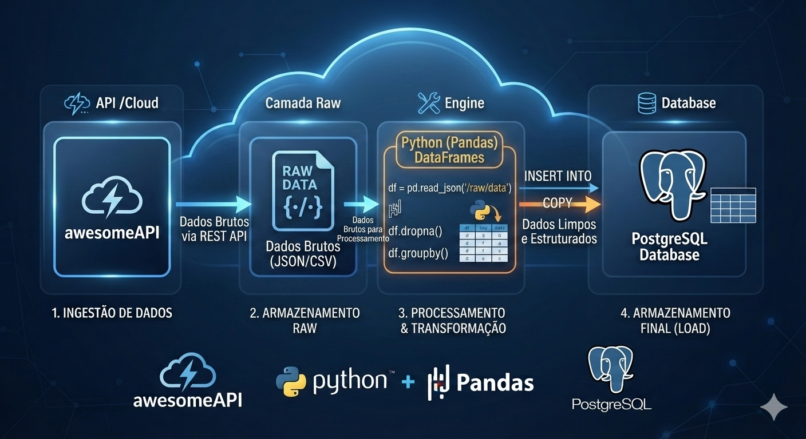

# pipeline-cambio

Pipeline de dados do módulo M3 (NExT Dados 2026.1, CESAR School).

Coleta cotações de cambio da AwesomeAPI, guarda a camada raw,
transforma com Pandas e carrega em PostgreSQL e MongoDB Atlas.

## Como rodar
1. Criar e ativa o venv
2. pip install -r requirements.txt
3. python src/pipeline.py

## Diagrama
